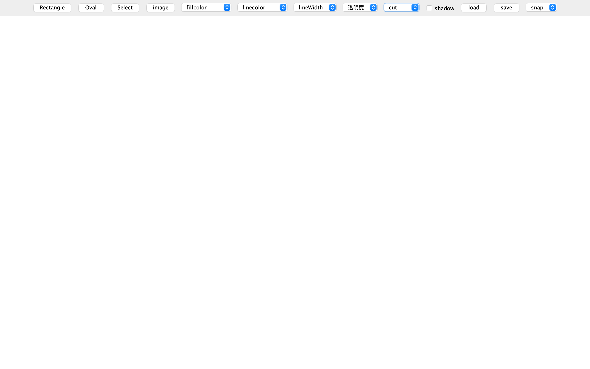

# gui_java
javaを用いたgraphic user interfaceの作成

### how to use
```
$ javac MyApplication.java
$ java MyApplication
```

<!--  -->

### 機能の説明

図形の作成 -> 長方形(Rectangle),円形(Oval)  
描画した画像の選択(select) 図形の形、色の変更が可能  
図形の塗り色の指定(fillcolor)  
図形の枠色の指定(linecolor)  
枠線の指定(lineWidth)  
透明度の指定(透明度)

option
図形を選択した状態でcut,copy,paste,delete

load 図形のアップロード  
save Canvasの保存